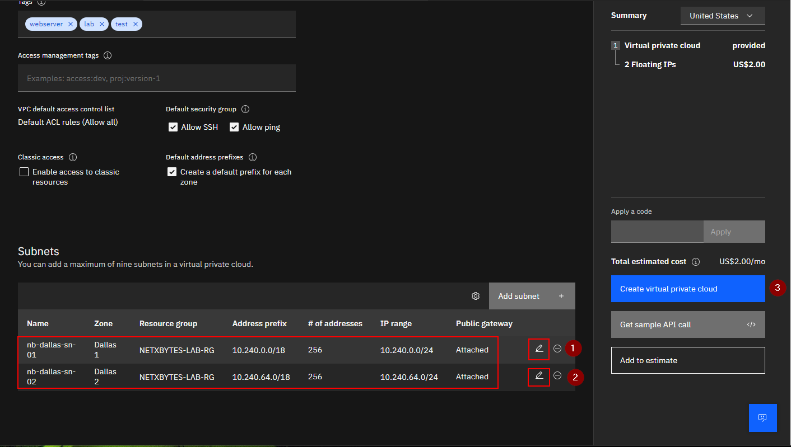

# IBM Cloud VPC WIth SUBNETS project 
Objective: Create and Configure Virtual Private Cloud (VPC)  with 2 subnets.

    0. Create resource group
    1. Create VPC in that resource group
    2. Create 2 subnets with public gatway access
    3. Create SSH keys 
    4. Create ACL and attach subnets (This is about controling access to subnets)
    5. Create SG (This is about controling access to virtual machines)
    6. Create a vm - add to sg - add to subnet - add floating IP

## Network Map

## Create Resource group

## Create VPC inside the resource group

### Edith and rename the subnet names and create

  

  
## Create and Configure access control list (ACL)

### Add inbound, outbound rules and attach subnets

    SSH
    HTTP
    HTTPS
    ICMP

## Create Security Groups

### Add Inbound and outbound rules

    SSH
    HTTP
    HTTPS
    ICMP

## Add SSH Key(s)

### Grenerate SSH Key(s)

### Click Create and add the generated publick 

## Create Virtual Machine Instances

### Edith Change the security group to the right one

## Create Floating IP (Pulic Gateway) 
### For internet access to VM 
### Attached the server/vm that you want to access the internet to the floating IP

## Add Load Balancer (Round Robin)
### for webservers in both private subnets 
### this webservers should not have internet access (Don't attach floating IPs)

### Create Back End Pool

### Click on Attach Web Servers to add the webservers

### Create Front End Listeners

### Add Security Group

### Click on the websvr-lb to open the load balancer details

